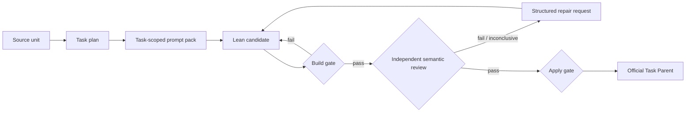

# ToyApollo

[简体中文](README.zh-CN.md) · [Architecture](docs/architecture.md) ·
[Development](docs/development.md) · [Case studies](examples/case-studies/)

ToyApollo is an evidence-bound agent pipeline for source-faithful Lean 4
formalization. It turns textbook-scoped tasks into Lean candidates while
keeping three claims separate:

1. **Build:** the candidate elaborates in Lean.
2. **Semantic review:** an independent reviewer checks the source claim,
   proof route, public Interface, and direct consumers.
3. **Apply:** completion lands only from a valid, current review with
   `phase2_status=pass`.

The project exists because compiling code can still formalize the wrong
statement, omit a source-domain assumption, hide a proof step behind a new
premise, or replace the source route with a library shortcut.

## How it works



Prompt packs, build receipts, review requests, repair histories, batch queues,
and the operational SQLite database live in a private evidence plane. The
public source plane keeps the runtime, tests, Lean Modules, documentation, and
seven small immutable case-study exports. See
[`docs/repository_scope.md`](docs/repository_scope.md).

## Start with the failures

All seven public examples contain an initial Lean subject that compiles.
Semantic review still rejects it or invalidates an earlier pass.

| Case | What the build gate missed | What the review loop added |
| --- | --- | --- |
| [`def_8_5`](examples/case-studies/def_8_5/) | Total variation accepted arbitrary measures even though the source domain was probability measures | Probability guards, then a second repair for downstream evidence plumbing |
| [`def_10_1`](examples/case-studies/def_10_1/) | Almost-sure convergence mixed incompatible measure assumptions and later omitted the random-variable carrier | Reusable event/a.e. bridges, carrier preservation, and high-fanout consumer review |
| [`def_5_5`](examples/case-studies/def_5_5/) | A Mathlib alias replaced the source-facing finite-subfamily definition | An explicit equation plus a bridge to the library predicate |
| [`def_6_6`](examples/case-studies/def_6_6/) | Missing measurability and `EReal.toReal` made an undefined integral look total | A componentwise integrability gate and an explicit `Option` result |
| [`ex_8_2_1`](examples/case-studies/ex_8_2_1/) | The carrier drifted from `ℝ × ℝ` to `ℕ × ℝ` | An owner-level contract decision and a real-carrier pushforward |
| [`ex_8_3_4`](examples/case-studies/ex_8_3_4/) | One feasible transport plan was presented as solving an optimization problem | Optimizer quantification and the missing Wasserstein Interface |
| [`thm_8_2`](examples/case-studies/thm_8_2/) | A finished Mathlib product theorem bypassed the requested construction | An explicit fibre set function, measure construction, and uniqueness route |

These cases are mechanism demonstrations, not benchmark scores. Their public
timelines retain verdict classes and private-evidence hashes without publishing
the complete source corpus or mutable runtime packs. The collection covers at
least six distinct primary failure modes; six cases expose statement or
Interface drift, while `thm_8_2` isolates proof-route drift.

## Five-minute inspection

Prerequisites:

- Python 3.12 is the currently verified contributor environment. A minimum
  supported Python version has not yet been declared.
- [Elan](https://github.com/leanprover/elan); the repository pins Lean through
  [`lean-toolchain`](lean-toolchain).

From a PowerShell checkout:

```powershell
python -m venv .venv
.\.venv\Scripts\Activate.ps1
pip install -r requirements.txt

python .\run_chapter.py -h
python .\tools\check_repo_hygiene.py
python .\tools\prepare_public_snapshot.py
python .\tools\check_case_studies.py
lake build ToyApollo.Output.def_8_5

lake env lean .\examples\case-studies\def_8_5\initial.lean
lake env lean .\examples\case-studies\def_8_5\final.lean
```

The last two commands should both compile. Compare the code and then read the
case's `review-timeline.json`: compilation alone cannot distinguish the two
Interfaces. The case-study index contains the command for compiling all 14
public snapshots.

More setup and focused test commands are in
[`docs/development.md`](docs/development.md).

## Repository map

| Path | Purpose |
| --- | --- |
| `run_chapter.py` | Stable CLI entry |
| `src/toy_apollo/` | Active Python package home |
| `ToyApollo/Output/` | Lean Task Parents and task-owned support Modules |
| `tests/` | Python workflow and state tests |
| `tools/` | Explicit hygiene, migration, and reconciliation commands |
| `examples/case-studies/` | Curated, path-relative review histories |
| `docs/architecture.md` | Stable Module and evidence model |
| `docs/phase2/` | Detailed operator contracts for Phase 2 |

The root-level `src/*.py` files are a temporary legacy Adapter during package
migration. New implementation belongs under `src/toy_apollo/`.

## Project status and limits

ToyApollo is a research prototype, not a proof of autonomous mathematical
correctness.

- A semantic review is model-assisted evidence, not a substitute for Lean's
  kernel or expert mathematical judgment.
- A Lean build establishes technical validity only; it does not establish
  source fidelity.
- The complete textbook-derived input corpus and mutable review packs are not
  distributed in the public source plane.
- Published case studies are selected mechanism examples and must not be read
  as an unbiased accuracy, cost, or productivity evaluation.
- The current CLI is local-first and the complete cross-platform support matrix
  has not yet been established.

## Documentation

- [Architecture](docs/architecture.md)
- [Repository and evidence scope](docs/repository_scope.md)
- [Development setup](docs/development.md)
- [Phase 2 overview](docs/phase2/README.md)
- [Semantic review criteria](docs/phase2/review_criteria.md)
- [Status contract](docs/phase2/status_contract.md)
- [Contributing](CONTRIBUTING.md)
- [Security](SECURITY.md)

## License

ToyApollo is released under the [MIT License](LICENSE).
