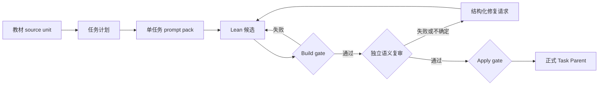

# ToyApollo

[English](README.md) · [架构](docs/architecture.md) ·
[开发指南](docs/development.md) · [公开案例](examples/case-studies/)

ToyApollo 是一条以证据绑定为核心的 Lean 4 教材形式化 agent
流水线。它把教材范围内的任务转化为 Lean 候选，同时严格区分三件事：

1. **构建：**候选能够被 Lean elaboration。
2. **语义复审：**独立 reviewer 检查原始主张、证明路线、公开 Interface
   和直接下游使用者。
3. **落地：**只有当前且有效、投影为 `phase2_status=pass` 的 review
   才能通过 apply gate 写入完成状态。

这个区分很重要：能够编译的 Lean 代码仍可能形式化了错误的命题、遗漏
原文定义域、把证明步骤藏进新前提，或者用现成库定理绕过教材证明路线。

## 工作流



完整 prompt pack、构建收据、review 请求、修复历史、批量队列和运行态
SQLite 数据库位于私有 evidence plane。公开 source plane 只保留运行代码、
测试、Lean Modules、稳定文档和两份固定的案例导出。详见
[`docs/repository_scope.md`](docs/repository_scope.md)。

## 先看失败案例

两个案例的初始 Lean 文件都能够编译，但仍被语义复审拒绝。

| 案例 | Build gate 没有发现什么 | Review loop 增加了什么 |
| --- | --- | --- |
| [`def_8_5`](examples/case-studies/def_8_5/) | 源定义针对概率测度，但公开 Interface 接受任意测度 | 概率测度约束，以及第二轮下游证据迁移 |
| [`def_10_1`](examples/case-studies/def_10_1/) | 几乎处处收敛的事件形式混用了测度假设，后续又发现缺失随机变量 carrier | 可复用 bridge、carrier 保持和高 fanout 下游检查 |

这些是机制展示，不是 benchmark 分数。公开 timeline 保留 verdict 分类和私有
证据哈希，但不公开完整教材语料与可变运行目录。

## 五分钟检查

当前已验证的贡献者环境为 Python 3.12；项目尚未声明最低 Python 版本。
Lean 版本由 [`lean-toolchain`](lean-toolchain) 固定，建议通过
[Elan](https://github.com/leanprover/elan) 安装。

在 PowerShell 中执行：

```powershell
python -m venv .venv
.\.venv\Scripts\Activate.ps1
pip install -r requirements.txt

python .\run_chapter.py -h
python .\tools\check_repo_hygiene.py
python .\tools\prepare_public_snapshot.py
lake build ToyApollo.Output.def_8_5

lake env lean .\examples\case-studies\def_8_5\initial.lean
lake env lean .\examples\case-studies\def_8_5\final.lean
```

最后两个文件都应编译。真正的差异要结合
`review-timeline.json` 阅读：build gate 无法单独判断两个 Interface 的语义。

## 仓库地图

| 路径 | 用途 |
| --- | --- |
| `run_chapter.py` | 稳定 CLI 入口 |
| `src/toy_apollo/` | 当前 Python package 归属 |
| `ToyApollo/Output/` | Lean Task Parent 与任务自有 support Modules |
| `tests/` | Python 工作流与状态测试 |
| `tools/` | 卫生检查、迁移与状态协调命令 |
| `examples/case-studies/` | 裁剪后的 review 历史 |
| `docs/architecture.md` | 稳定 Module 与证据模型 |
| `docs/phase2/` | Phase 2 详细操作契约 |

根目录 `src/*.py` 是 package 迁移期间的临时 legacy Adapter；新
Implementation 应进入 `src/toy_apollo/`。

## 当前限制

- ToyApollo 是研究原型，不证明 agent 能自主保证数学正确性。
- 语义复审是模型辅助证据，不能替代 Lean kernel 或专家判断。
- Lean 构建只证明技术有效性，不证明教材忠实度。
- 完整教材输入与可变 prompt packs 不在公开 source plane 中分发。
- 两个公开案例经过选择，不能用来推断无偏准确率、成本或生产率。
- 当前 CLI 以本地运行为主，完整跨平台支持矩阵尚未建立。

## 文档

- [Architecture](docs/architecture.md)
- [仓库与证据范围](docs/repository_scope.md)
- [开发环境](docs/development.md)
- [Phase 2 概览](docs/phase2/README.md)
- [语义复审标准](docs/phase2/review_criteria.md)
- [状态契约](docs/phase2/status_contract.md)
- [贡献指南](CONTRIBUTING.md)
- [安全策略](SECURITY.md)

## 许可证

首次公开发布前仍需确认许可证。当前没有许可证不代表允许复制或复用代码。
