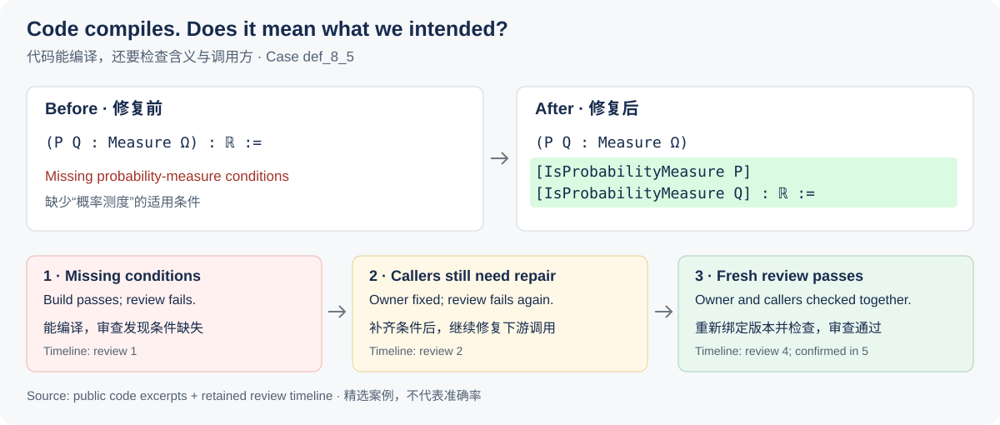

# ProbabilityTheoryFormalization

**AI Agent 工作流与验证**

以概率论教材为场景，研究和开发 AI 辅助代码生成、自动检查、独立审查与迭代修复流程。目标是让生成的 Lean 代码符合原文含义，并能被其他模块正确调用，同时保留可追溯的失败和修复记录。

**个人角色：**Shuo Deng，负责工作流与形式化开发，使用 AI 辅助；下方预印本第一作者。

**技术栈：**Python、Lean 4、SQLite、自动化验证。

[English](README.md) · [论文](https://arxiv.org/abs/2607.27298) · [两个代表案例](#两个代表案例) · [已合并的协作贡献](https://github.com/wkshum/ProbabilityTheory/pull/8) · [联系邮箱](mailto:kdsdengshuo2823@gmail.com)

## 我的职责与贡献

我是 **Shuo Deng**，负责这套工作流的开发，并参与教材形式化。具体工作包括：

- **流程设计与实现：**将教材内容组织成任务，串联代码生成、检查和迭代修复，支持中断后的恢复。[流程与架构](docs/architecture.md)
- **验证与状态管理：**将审查结论绑定到实际检查的代码及依赖版本，保留构建和修复记录，使用 SQLite 管理状态，防止旧审查批准已经变化的代码。[状态与证据管理](docs/workspace_state.md)
- **失败分析与研究：**分析遗漏条件、定理接口变化和下游调用问题，提交经过审查的修复，并共同撰写概率论形式化预印本。[完整案例](examples/case-studies/) · [已合并修复](https://github.com/wkshum/ProbabilityTheory/pull/7)

**合作分工与 AI 辅助：**Kenneth W. Shum 是教材作者、论文合作者，并维护[协作教材仓库](https://github.com/wkshum/ProbabilityTheory)。我的工作侧重流程和形式化开发；教材原文的修正与教材作者讨论。AI 工具用于代码生成、证明搜索、修复、审查和文档辅助；这些产物不等于全部由本人手写，数学含义的判断仍需要人工参与。

## 可查看的成果

| 成果 | 证据入口 |
| --- | --- |
| **第一作者预印本** | [*From Lecture Notes to Lean: Formalizing a Textbook on Probability Theory*](https://arxiv.org/abs/2607.27298)，作者：**Shuo Deng**、Kenneth W. Shum。状态：**arXiv 预印本**，2026 年 7 月。 |
| **公开系统与案例** | [工作流实现](src/toy_apollo/)与[八个精选案例](examples/case-studies/)，包含代码对照和审查时间线。 |
| **已合并的协作贡献** | [第二章：对齐假设与接口](https://github.com/wkshum/ProbabilityTheory/pull/7)、[第三章：重构测度扩张](https://github.com/wkshum/ProbabilityTheory/pull/8)，均已合并至 Kenneth 的仓库。 |

审查历史评估仍在进行：当前分析审查结论的一致性与修复轨迹，最终评估结果尚未在此发布。

## 两个代表案例

### 发现自动检查通过、但遗漏适用条件的代码

**问题：**一个原本针对概率测度的定义接受了任意测度，可能在适用范围外产生误导性结果。

**处理：**审查定位缺失条件，修复显式补上概率测度约束，并更新受影响的调用方。

**结果：**修正后的定义及下游用法通过了新的审查。初始版本和最终版本都能编译，区别在于是否表达了预期的数学含义。

[代码与完整记录](examples/case-studies/def_8_5/) · [修复前](examples/case-studies/def_8_5/initial.lean) · [修复后](examples/case-studies/def_8_5/final.lean)

### 修复当前模块后，继续检查并修复下游调用

**问题：**一个定理通过把缺失的证明当作输入而获得编译通过。补上内部证明后，调用方仍依赖旧接口。

**处理：**实现证明，补充调用方所需的接口，再更新调用方并重新审查。

**结果：**新的审查接受了修复后的定理和下游迁移。

[案例与审查时间线](examples/case-studies/thm_14_8/) · [完整证明](ToyApollo/Output/thm_14_8.lean)

第二例的简短前后文件是**简化的接口演示**，完整数学证明见单独链接。八个案例均经过选择，**不代表准确率、成本或生产率评测结果**。

*图据[第一例的审查时间线](examples/case-studies/def_8_5/review-timeline.json)整理，代码行摘自其公开快照。*

## 技术材料与进一步阅读

流程先检查能否编译，再独立审查是否符合原文含义；只有审查对应的代码和依赖仍然有效，才接受修改。模型辅助审查提供证据，不能保证数学判断绝对正确。

- [系统架构与流程](docs/architecture.md)
- [安装与验证命令](docs/development.md)
- [八个案例及复现命令](examples/case-studies/)
- [审查标准](docs/phase2/review_criteria.md)与[状态规则](docs/phase2/status_contract.md)
- [研究背景、相关工作与限制](docs/project_notes.md)
- [仓库范围与公开历史说明](docs/repository_scope.md)
- [贡献指南](CONTRIBUTING.md) · [安全策略](SECURITY.md) · [MIT 许可证](LICENSE)

项目旧名为 **ToyApollo**，现有代码标识保留旧名以维持兼容。简历和引用请统一使用 **ProbabilityTheoryFormalization**。
