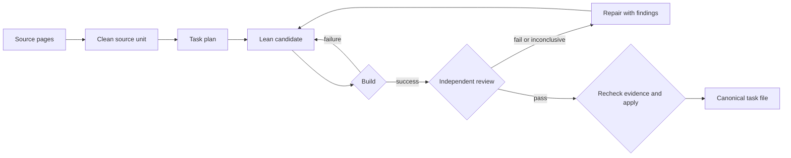

# Architecture

ProbabilityTheoryFormalization develops AI-assisted textbook formalization
through separate build, independent review, and apply gates. Python coordinates
the workflow; Lean checks the formal code; SQLite indexes retained evidence.

## Runtime and corpus

- Installed command: `formalize`.
- CLI routing: `src/formalization_engine/cli/app.py`.
- Python package: `src/formalization_engine/`; the earlier compatibility package
  has been retired.
- Canonical Lean tree: `ProbabilityTheory/chapter_XX/`.
- Module lookup: `manifest_by_chapter.csv`.
- Mutable drafts, packs, logs, and state: the separately resolved artifact root.

Only phases 0, 1, and 2 are active CLI phases:



Source ingestion and planning require source material supplied by the operator.
The public release includes code and a build manifest, while the owner's source
corpus, plans, catalog policy, upstream snapshots, and operational database remain
private. A public clone can compile the corpus and run the isolated demonstration;
it cannot reconstruct the owner's completion verdict from the build manifest.

## Three separate claims

| Claim | Evidence | Scope |
| --- | --- | --- |
| Code compiles | The exact Lean subject and build receipt | Technical validity in that environment |
| Code matches the requested mathematics | A current, hash-bound independent review | Statement and requested proof-route interpretation |
| Reviewed code was accepted | Successful `review-apply` with current evidence | The exact accepted subject; not a guarantee of reviewer correctness |

`review-now` prepares the request and exposes the next action. The outer agent or
operator invokes an independent reviewer; preparation alone does not run a model
or complete the task. Failed reviews lead to repair, and a changed subject or
review basis rejects stale evidence before acceptance. Application restores prior
canonical bytes on failure.

The [complete workflow demonstration](workflow_demo.md) exercises these production
functions with real Lean builds and an isolated SQLite database. Its default
recorded teaching opinions are replayed in an explicitly simulated protocol
envelope. They are not new model judgments or textbook-catalog authority. The
same runner can invoke a separately configured, independent external reviewer.

## Lean ownership and verification

The vocabulary in [CONTEXT.md](../CONTEXT.md) separates the task's public statement,
task-owned proof support, interface translations, and genuinely shared support.
The authoritative textbook statement is supplied source material; a generated
prompt pack is its working copy.

For example, build a task and its dependencies with:

```console
lake build ProbabilityTheory.chapter_08.def_8_5
```

`lake build ProbabilityTheory` builds every module in the library. This does not
mean all modules can be imported into a single environment. The supported joint
chapter imports are checked separately by `tools/check_chapter_imports.py`;
chapters 1 and 7 retain the documented Kenneth/Mathlib `Partition` boundary.

## Review identity and operational state

The review binds the source, subject bundle, relevant support/dependencies,
toolchain, prompt/rubric, and review evidence. The production acceptance decision
continues to use the complete basis. [Review-basis diagnostics](review_basis_pilot.md)
explain which dimensions changed without weakening freshness checks. The small
target-identity experiment is a design probe, not an implemented semantic cache.

SQLite is an index over immutable evidence. The legacy JSON ledger remains
protected import history after database activation. `formalize --status` is a
read-only roots diagnostic; the full workspace's `formalize state validate --json`
queries its catalog verdict. Compatible PASS, exact-bundle coverage, typed
authority, and candidate maintenance are distinct dimensions. See
[workspace_state.md](workspace_state.md).

Kenneth and historical MAT repositories are external review/evidence sources.
External PR review binds one exact PR head and never lands it automatically in
the canonical corpus. The transport fork is not another active refinement tree.

## Publication and remaining limits

The [release exporter](repository_scope.md) selects committed source, removes
source-derived block prose from published Lean, and records source/published
fingerprints. It does not copy private Git history. The public manifest supports
build lookup and content checks, not review authority.

The runtime remains a research system. Some review modules have broad
responsibilities; dependency versions are not fully locked. Cordis configuration
initialization is supported, but complete end-to-end operation on a second
project has not been established. Review comparisons are
[prepared for prospective execution](review_comparison_pilot.md), with empirical
quality claims pending independent adjudication.
