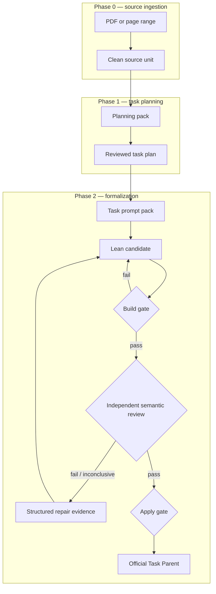
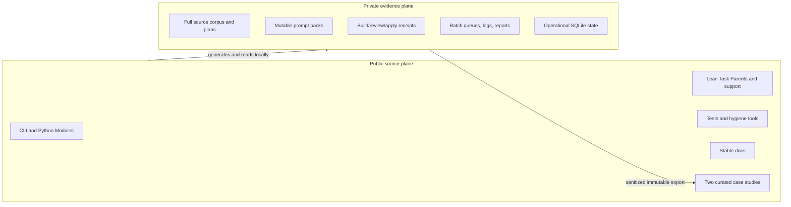

# Architecture

ToyApollo is a local-first pipeline for converting textbook-scoped probability
tasks into source-reviewed Lean 4 output. Its central design choice is to keep
technical validity, semantic fidelity, and landed completion as different
authorities.

## Trust model

No single artifact proves that a task is complete:

| Claim | Authority | What it does not prove |
| --- | --- | --- |
| The subject elaborates | `candidate_vN.lean` plus `build_result_vN.json` | Source fidelity or proof-route fidelity |
| The subject matches the source | A current, hash-bound semantic-review result | That the result has been applied |
| The task is cleanly landed | `review-apply` projecting `phase2_status=pass` | Universal mathematical correctness outside the reviewed basis |

The Interface for this model is deliberately narrow: callers submit a
task-scoped subject to the gates; the Implementation may collect source,
dependency, downstream, audit, and freshness evidence behind that Interface.
This creates Leverage for CLI callers and Locality for review-policy changes.

## Runtime flow



The stable CLI entry is `run_chapter.py`; active routing lives in
`src/toy_apollo/cli/app.py`. Only Phases 0, 1, and 2 are part of the current
Interface.

## Source plane and evidence plane



The separation is about authority and publication scope, not deletion.
Evidence remains preserved even when it is ignored by the source repository.
See [repository_scope.md](repository_scope.md) for exact classifications.

## Domain Modules

ToyApollo uses the vocabulary in [`CONTEXT.md`](../CONTEXT.md):

- **Textbook Source** is the mathematical authority. A prompt pack mirrors it
  but does not replace it.
- **Task Parent** owns the public Lean statement for one textbook task.
- **Proof-Layer Support** holds one coherent layer of a task-owned proof.
- **Interface Support** translates between textbook definitions, local
  conventions, and Mathlib Interfaces.
- **Shared Support** is reusable across real task families; extraction merely
  to shorten a file does not justify this Module.
- **Source-Statement Risk** records a mismatch that requires a convention or
  statement decision rather than repeated proof search.
- **Phase 2 Completion** is landed only by build, independent review, and apply.

## Python ownership

`src/toy_apollo/` is the target package home. The root-level `src/*.py` Modules
still contain active compatibility Implementation, so the migration is not
complete. The current legacy Adapter keeps the stable CLI working while new
Implementation moves into the package.

This is a temporary Seam, not evidence that two permanent Adapters are needed.
New code belongs under `src/toy_apollo/`; removing the legacy Adapter requires
focused import and CLI regression tests.

## Lean ownership

`ToyApollo/Output/<task_id>.lean` is the active Task Parent path. A large task
may own several Proof-Layer Support Modules when each carries one coherent
proof responsibility. Shared Support requires a second real consumer or a
stable recurring textbook Interface.

Build success should normally be checked with:

```powershell
lake build ToyApollo.Output.<task_id>
```

The build result is a technical health signal, not semantic completion.

## Review evidence

A valid semantic review binds at least:

- task and source identity;
- review subject and content hash;
- prompt and rubric versions;
- complete review-basis hash;
- source claims and their Lean landings;
- public Interface and direct downstream consumers;
- verdict, `proof_class`, and `completion_class`.

The review Interface is the test surface. Tests and callers should exercise the
same review/apply Seam rather than mutating metadata to manufacture completion.

## Operational state

The sibling artifact root owns `state.sqlite3`. It is a rebuildable index over
retained evidence, not semantic authority by itself. The older
`project_ledger.json` is frozen compatibility evidence after SQLite activation.

`python run_chapter.py --status` is read-only and reports paths resolved for
the current process. It does not declare global campaign authority.

## Known architectural debt

- Python ownership is split between `src/*.py` and `src/toy_apollo/`.
- Several Phase 2 Modules expose wide Interfaces and contain multiple domain
  responsibilities.
- Python dependency versions and the minimum Python version are not pinned.
- CI does not yet provide a single format/lint/type/test/docs gate.
- The public case-study exporter is currently a curated process rather than a
  dedicated reproducible export command.

These are explicit follow-up areas; the public documentation does not claim
they are already solved.
